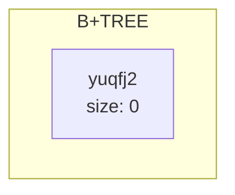
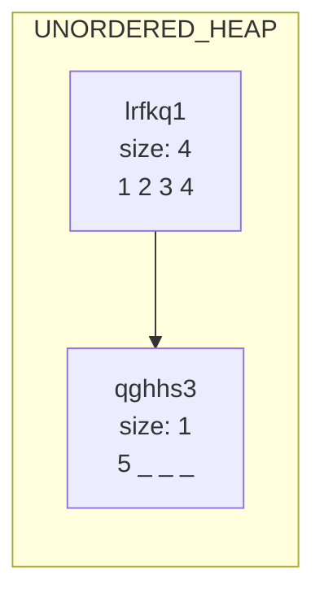

```mermaid
graph TD
subgraph B+TREE
yuqfj2[yuqfj2<br/>size: 0<br/>]
end
```

```mermaid
graph LR
subgraph UNORDERED_HEAP
lrfkq1[lrfkq1<br/>size: 4<br/>1 2 3 4 ]
qghhs3[qghhs3<br/>size: 1<br/>5 _ _ _ ]
lrfkq1-->qghhs3
end
```
