---
title: "Project Phase 1 - B+Tree Indexing"
author: [M21 Data Systems]
date: "12-10-2020"
keywords: [Markdown]
titlepage: false
colorlinks: true
table-use-row-colors: true
toc: true
header-includes:
- |
  ```{=latex}
  \usepackage{awesomebox}
  \usepackage{tcolorbox}
  \usepackage{longtable}
  \usepackage{booktabs}

  ```
pandoc-latex-environment:
  noteblock: [note]
  tipblock: [tip]
  warningblock: [warning]
  cautionblock: [caution]
  importantblock: [important]
  tcolorbox: [box]
...

# Project Phase 1 - B+Tree Indexing

:::box
**Deadline - 11:00 PM, 22nd October 2021**  
:::

The objective of Phase 1 is to implement a B+Tree index. The disk-based index is built on top of an unordered heap file organization. In this project we assume records are unique 1-sized tuples consisting of non-negative integers (records consist of only one attribute which is a key attribute). This phase consists of 3 parts - (a) Implement B+-Tree insertion, (b) implement B+-Tree deletion and (c) perform analysis. Just like for Phase 0, we will use GitHub Classroom. Accept the group assignment on GitHub Classroom using this [link](https://classroom.github.com/a/gguYIAiY). To run this project we recommend you install the CLion IDE. Additionally, the project is built using CMake (version `3.20`). 

:::box
**strongly suggested reading: **Section 17.3 (Dynamic Multilevel Indexes Using B-Trees and B+-Trees) from Pg617 - Pg624, Chapter 17 (Indexing Structures for Files and Physical Database Design), _Fundamentals of Database Systems_, 7th Edition, R Elmasri, Shamkant B Navathe, R Elmasri, SB Navathe
**This document does not explain B+-Tree indexing in detail, it is recommended you read the text book before starting on this project phase.**
:::

## Queries

The provided codebase implements a query execution engine that processes the following 6 commands - `INSERT`, `DELETE`, `RANGE`, `SOURCE`, `EXPORT` and `QUIT`.

| Syntax | Description |
|---|--------|
| `INSERT <key>` | inserts `key` into heap and B+-Tree |
| `DELETE <key>` | deletes `key` from heap and B+-Tree |
| `RANGE <key1> <key2>` | performs a range query to retrieve keys within in the range [key1, key2]. The results are written in file `data/range_[key1_key2].txt`. This command also prints the number of block accesses needed to perform this query using the B+-Tree and just using the heap |
| `SOURCE <file>` | executes all commands in file `data/file` |
| `EXPORT` | exports heap and B+-Tree into files `heap.md` and `data/bptree.md` respectively |
| `QUIT` | quits the command line interpreter |


## Unordered Heap (`class UnorderedHeap`)

We use an unordered heap to organize the data on the disk (`class UnorderedHeap`). The heap consists of a linked list of data blocks (`class Block`). The heap object contains a pointer that points to the first data block in the list (`UnorderedHeap::first_block_ptr`). Each data block can have at most `BLOCK_SIZE`(= 4) records. Similar to the `SimpleRA` code base, each data block is stored as a file in the `temp` directory. All the functions for the unordered heap have already been implemented. When a new record is inserted, we start searching for an "empty space" in a block starting from the first block. If no empty space exists, we insert the record in a new block. An "empty space" is generated when a deletion occurs. In the code, an empty space is denoted using the `DELETE_MARKER`(= -1). You can experiment with the unordered heap by running the list of commands in file `data/heap`. It generates the following linked list

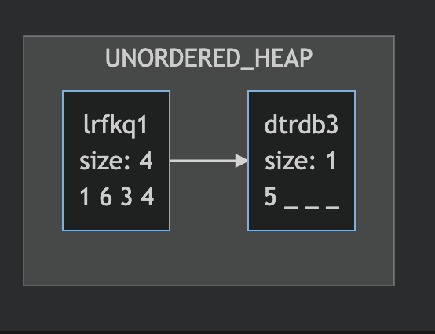{ height=4cm }

The name of the blocks `lrfkq1` and `dtrdb3` are the names of the files in which the first and second data blocks are stored respectively.

## B+-Tree Indexing (`class BPTree`)

A B+-Tree (`class BPTree`) index is a tree structure consisting of tree nodes (`class TreeNode`) - internal nodes (`class InternalNode`) and leaf nodes (`class LeafNode`) satisfying the following properties. An internal node consists of keys and tree pointers.

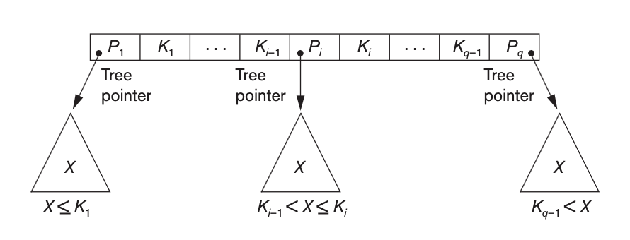

All the elements in the subtree rooted at $P_i$ are greater than $K_{i-1}$ and less than or equal to $K_i$. All the keys in the internal node are sorted ($K_1 < \ldots < K_{q-1}$). Every internal node except the root node should have atleast $\left \lceil{f/2}\right \rceil$ and at most $f$ children (tree pointers) where $f$ is the fanout of the B+-Tree (`FANOUT = 3`). 

A leaf consists of `<K, data_pointer>` pairs. Where `K` is the key or value of the indexing feild and `data_pointer` points to the location of the record on the disk. Data pointers could be block or record pointers - in this project we use record pointers (`class RecordPtr`). Each record pointer holds a pointer to the block and the position of the record in the block. 

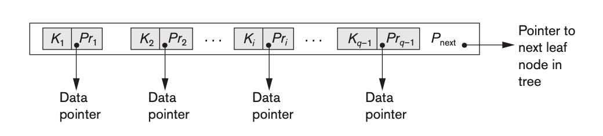{ height=3cm }

Every leaf points to the next leaf. Every leaf node (except if root node) should have atleast $\left \lceil{f/2}\right \rceil$ and at most $f$ children (<key, record pointers>) where $f$ is the fanout of the B+-Tree.

:::box
The insertion and deletion operators have not been implemented in the code base. Implementing B+Tree insertion is part (a) and deletion is part (b) of this project.
:::

## Chart

A fun aspect of this project is the dynamic generation of  a visual mermaid chart stored in file `data/chart.html`. The chart generated visually shows the B+-Tree and heap. The insert and delete funtions for the B+-Tree are not implemented, therefore, the boiler plate will only generate a chart of the heap. To view this chart open the `data/chart.html` file in a web browser.

:::note
 Both CLion and VS Code are capable of rendering this chart
:::

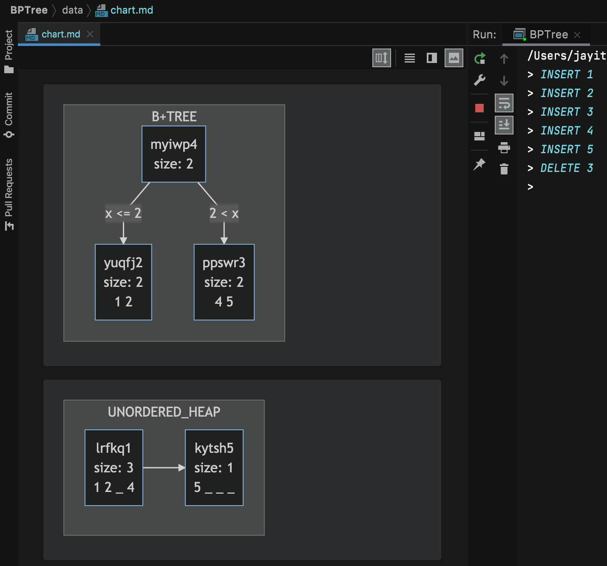{ height=9.705cm }

## Code Structure

The code base is structured as follows - the unordered heap (global object `heap`) consists of a linked list of multiple data blocks (called `Block`) and the BPTree (global object `bptree`) points to the root tree node. Any tree node (called `TreeNode`) is either an internal node (`InternalNode`) or a leaf node (`LeafNode`). An internal node consists of many children which point to tree nodes (internal or leaf). A leaf node contains many `<key, RecordPtr>` pairs. 

A given query is run both on the B+Tree and unordered heap. When insert is called on the heap, the heap returns a record pointer which points to the position of the inserted key on the disk. This key and returned record pointer should be inserted into the B+-Tree. The delete function is called on both the heap and the B+-Tree. As a part of this project, you will have to fill in the `insert` and `delete` functions in the `LeafNode` and `InternalNode` classes. The rest of the code has been written for you. It is recommended you follow the order of the functions we ask you to implement

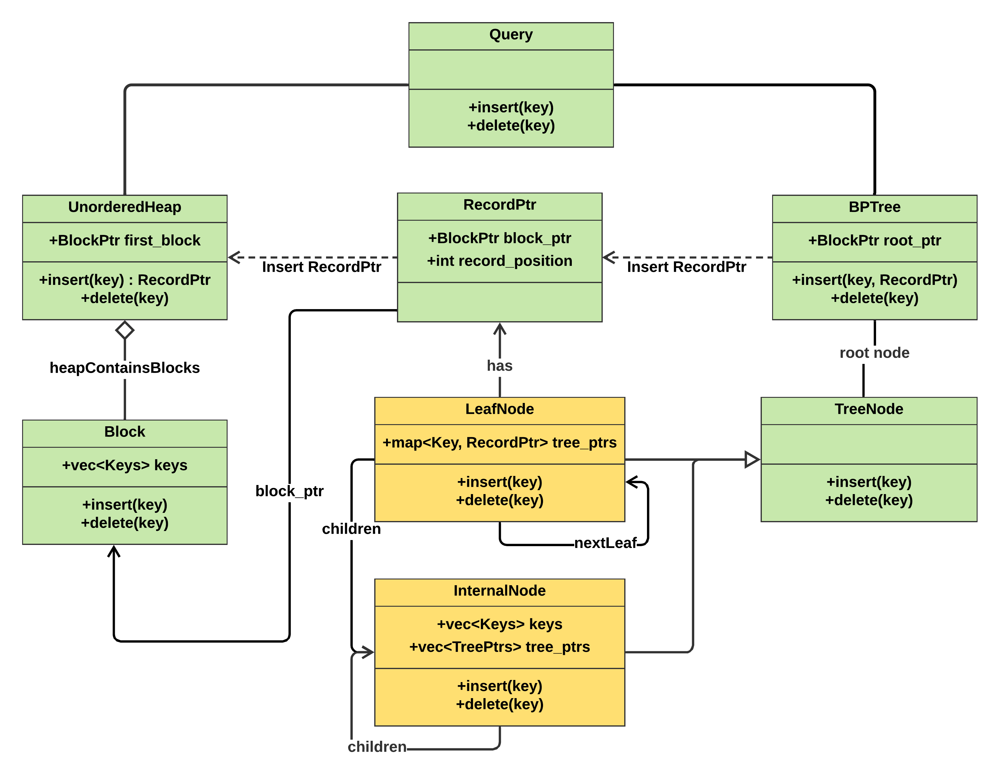


## Part (a) - Insertion

In this part, you have to complete two function definitions. The first is performing insert in leaf nodes.  

```cpp
TreePtr LeafNode::insert_key(Key key, RecordPtr record_ptr)
```

Implementing insertion in the leaf node is straight forward - if there is space in the leaf, we insert the <key, record_ptr> pair and write the leaf back to the disk. If there is no space in the leaf (overflow), split the leaf into two and return a tree pointer pointing to the new split leaf. 

:::box
When a leaf node `n` is split to create a new leaf node `split_node`, node `n` retains the smallest(key) $\left \lceil{f/2}\right \rceil$ `<key, RecordPtr>` pairs and the rest are inserted into `split_node`.
:::

The case where the root node is split is taken care of within the BPTree class. To test this function, run the set of commands from `leaf_insert`. The expected output is

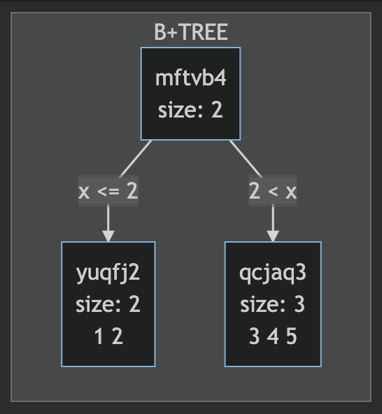{ height=5.5cm }

The second function to be implemented is insertion within internal nodes

```cpp
TreePtr InternalNode::insert_key(Key key, RecordPtr record_ptr)
```

This insert function should provide two capabilities - (1) It first finds the appropriate child to insert the <key, record_ptr> into and (2) If the chosen child returns a split node, then the insert function should include this new node as a new child; if the inclusion of the new child causes a split then the new split node should be returned. 

:::box
When internal node `n` is split to create a new node `split_node`, node `n` retains the first $\left \lceil{f/2}\right \rceil$ children of `n` and the rest are inserted into `split_node`.
:::

To test this function, run the set of commands from `internal_insert`.The expected output is

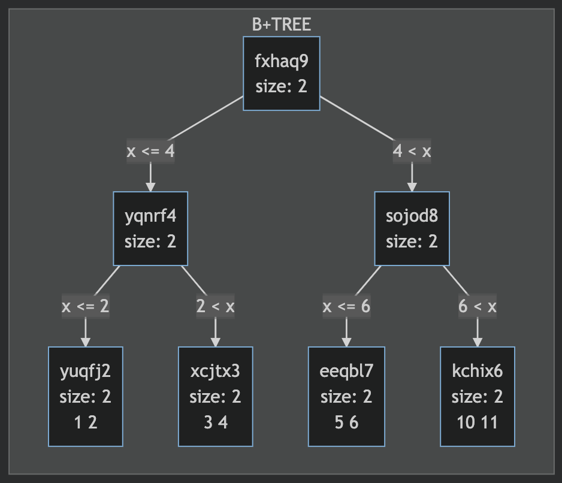{ height=7cm }


## Part (b) - Deletion

Deletion is a little more complicated than insertion. Again there are two functions to be implemented - deletion in the leaf nodes and internal nodes.  When inserting, an overflow can occur whereas when deleting an underflow can occur. To handle underflows that violate the properties of B+-Trees there are broadly two options - (1) redistribute the data in the node with a sibling so they both have at least $\left \lceil{f/2}\right \rceil$ children or (2) merge with a sibling such that together they have at most $f$ children.

In this project strictly follow this preference order

:::box
1. If left sibling exists, and redistribution can occur - perform redistribution with left sibling else
2. If left sibling exists, and merging can occur - perform merge with left sibling else
3. If right sibling exists, and redistribution can occur - perform redistribution with right sibling else
4.  If right sibling exists, and merging can occur - perform merge with right sibling

When node `n` underflows and is redistributed with siblinng node `sib_node`, `n` takes just enough children from `sib_node` to have exactly $\left \lceil{f/2}\right \rceil$ children. 
:::


```cpp
TreePtr LeafNode::delete_key(Key key)
```

Merging and redistribution will happen through the parent node - therefore, deletion in the leaf node is simple - if key exists, delete <key, RecordPtr> pair. To test use `leaf_delete`

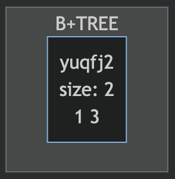{ height=3.5cm }

Deletion in the internal nodes is a little complex, again there are two tasks - (1) find the appropriate child to delete the key from and (2) check if the chosen child now underflows, if it underflows then perform the appropriate redistribute/merge operations as per the preference detailed above.

```cpp
TreePtr InternalNode::delete_key(Key key)
```

To test your code use the following files - `internal_delete1`, `internal_delete2`, `internal_delete3`, `internal_delete4`. This list is not exhaustive, you are encouraged to write your own cases.

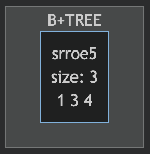{ height=2.8cm }

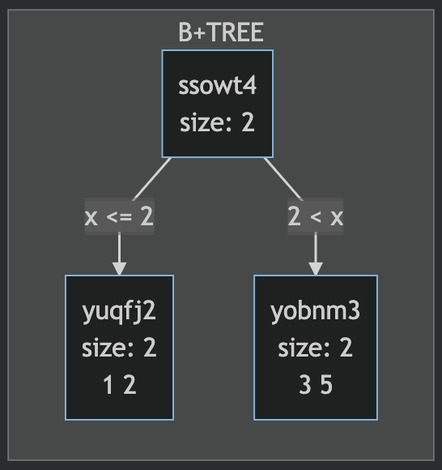{ height=5cm }

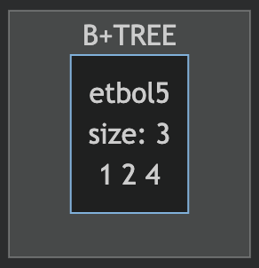{ height=2.8cm }

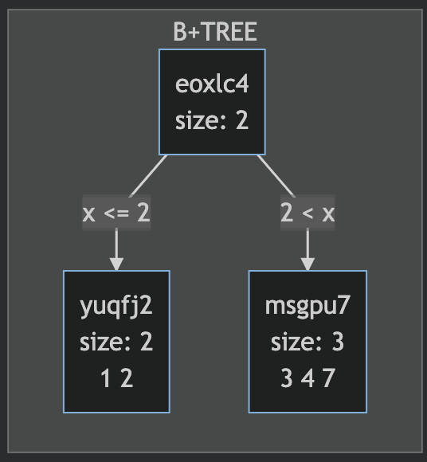{ height=5cm }


## Part (c) - Analysis

The RANGE command has been implemented for you. When RANGE is called, it prints the number of node accesses needed when the B+-Tree is used and when it is not as space-seperated integers. In this section you have to

1. generate a source file where you insert numbers 1-100 in some random order
2. plot the distribution of block accesses needed with and without the B+-Tree when calling `RANGE i i+1` on every valid i as two seperate traces (with and without)

Along the x-axis - number of block accesses and along y - either the count or the percentage. Submit this plot as a pdf in the `data` folder of your repository

Provide this graph for any 3 different values of `FANOUT`.

## Submission Instructions

All your code should be pushed to your GitHub repository. At the deadline, your codebase will be automatically downloaded. 

For any doubts please use the [doubts document](https://hackmd.io/@PjzB85_5Tum5GEZrVPegjw/SylMJ6fBY/edit) exclusively. If you need to interact with a TA, please email us at - [datasystems_ta_m21@IIITAPhyd.onmicrosoft.com](mailto:datasystems_ta_m21@IIITAPhyd.onmicrosoft.com) and someone will respond with an appropriate time slot. 

**This course is intolerant of plagiarism. Any plagiarism will lead to an F in the course.**

## References

B+-Tree deletion - [link](http://courses.cms.caltech.edu/cs122/lectures-wi2018/CS122Lec11.pdf)  
virtual functions - [Link](https://www.geeksforgeeks.org/virtual-function-cpp/)


<!-- > Will be deleted later.
To compile these notes to convert to pdf form run

```
pandoc "bptree.md" -o "bptree.pdf" --from markdown --template eisvogel --filter pandoc-latex-environment --listings
``` -->
